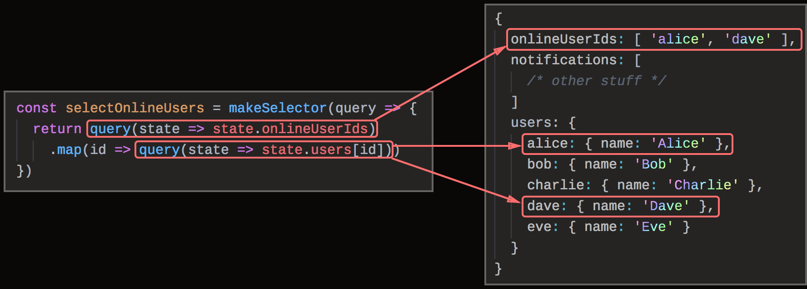

# rereselect

[![npm package][npm-badge]][npm] [![CircleCI builds][build-badge]][build]
[![Codecov][cov-badge]][cov]

[build-badge]:
  https://img.shields.io/circleci/project/github/taskworld/rereselect/master.svg?style=for-the-badge
[build]: https://circleci.com/gh/taskworld/rereselect
[npm-badge]:
  https://img.shields.io/npm/v/@taskworld.com/rereselect.svg?style=for-the-badge
[npm]: https://www.npmjs.com/package/@taskworld.com/rereselect
[cov-badge]:
  https://img.shields.io/codecov/c/github/taskworld/rereselect/master.svg?style=for-the-badge
[cov]: https://codecov.io/gh/taskworld/rereselect/src/master/src/index.ts

> Not to be confused with
> [Re-reselect](https://github.com/toomuchdesign/re-reselect) which is an
> enhancement to [Reselect](https://github.com/reduxjs/reselect). This is an
> entirely separate project.

A library that generates memoized selectors like
[Reselect](https://github.com/reduxjs/reselect) but:

- **Supports dynamic dependency tracking** à la Vue/VueX/MobX. Read
  [the motivation section](#motivation) to see why we need this.
- No need to declare upfront which selectors will be used.
- Introspection (hooks) API baked in to help debug performance problems.

**Design constraints:**

- Generated selector must be compatible with Reselect.

**Notes:**

- Requires an ES6 environment (or babel-polyfill).
- TypeScript typings require TypeScript 3.0.
- The state must be immutable.
- The selector logic must be pure and deterministic.
- rereselect’s selectors take 1 argument only — the state. If you need
  parameterized selectors, see the section
  [parameterized selectors](#parameterized-selectors).
- **No support.** This library is created to solve the problems we face. We
  open-source it in hope that it will be useful to others as well, but we have
  no plans in supporting it beyond our use cases. Therefore, feature requests
  are not accepted here.

## Motivation

Why a new selector library?

Here’s an example. Let’s say we have a list of online user IDs and a mapping
from user ID to user’s information. We want to select a list of online users, as
in this example:

![A selector that selects a list of online users. It depends on `state.onlineUserIds` and for each user ID in the latter, `state.users[name]`.](./docs/images/fine-grained.png)

Creating such selector is impossible using Reselect, because in Reselect,
**selectors must declare their dependencies statically upfront.** Since we
couldn’t know in advance which users will be online, we need to declare a
dependency on the whole `users` branch of the state tree:


This results in a selector that looks like this:

```js
const selectOnlineUsers = createSelector(
  state => state.onlineUserIds,
  state => state.users,
  (onlineUserIds, users) => {
    return onlineUserIds.map(id => users[id])
  }
)
```

This works, but this means that changes to unrelated users (`bob`, `charlie`,
`eve`) will cause the selector to be recomputed. This problem has been
[asked](https://stackoverflow.com/q/50965013/559913)
[multiple](https://github.com/reduxjs/reselect/issues/353)
[times](https://github.com/reduxjs/reselect/issues/360) with no efficient and
elegant solution.

With **rereselect**, selectors don’t declare their dependencies upfront.
Instead, they are inlined in the selection logic:

```js
const selectOnlineUsers = makeSelector(query => {
  const userIds = query(state => state.onlineUserIds)
  return userIds.map(id => query(state => state.users[id]))
})
```

The selection logic will receive a function `query` which can be used to invoke
other selectors. In doing so, the dependency will be tracked automatically. This
allows more fine-grained control over which part of the state tree would cause
the selector to be recomputed.



## Differences from Reselect

The Reselect “shopping cart” example:

```js
import { makeSelector } from '@taskworld.com/rereselect'

// “Simple” selectors are the same.
const shopItemsSelector = state => state.shop.items
const taxPercentSelector = state => state.shop.taxPercent

// Instead of `createSelector`, it is called `makeSelector`.
//
// Instead of declaring dependencies upfront, use the `query` function
// to invoke other selectors. In doing so, the dependency will
// automatically be tracked.
//
const subtotalSelector = makeSelector(query =>
  query(shopItemsSelector).reduce((acc, item) => acc + item.value, 0)
)
const taxSelector = makeSelector(
  query => query(subtotalSelector) * (query(taxPercentSelector) / 100)
)
const totalSelector = makeSelector(query => ({
  total: query(subtotalSelector) + query(taxSelector),
}))
```

Dynamic dependency tracking:

```js
let state = {
  fruits: {
    a: { name: 'Apple' },
    b: { name: 'Banana' },
    c: { name: 'Cantaloupe' },
  },
  selectedFruitIds: ['a', 'c'],
}

// I want to query the selected fruits...
const selectSelectedFruits = makeSelector(query =>
  query(state => state.selectedFruitIds).map(id =>
    query(state => state.fruits[id])
  )
)

// Use like any other selectors:
console.log(selectSelectedFruits(state)) // [ { name: 'Apple' }, { name: 'Cantaloupe' } ]

// Since data selection is fine-grained, changes to unrelated parts
// of the state will not cause a recomputation.
state = {
  ...state,
  fruits: {
    ...state.fruits,
    b: { name: 'Blueberry' },
  },
}
console.log(selectSelectedFruits(state)) // [ { name: 'Apple' }, { name: 'Cantaloupe' } ]
console.log(selectSelectedFruits.recomputations()) // 1
```

Reimplementing Reselect’s `createSelector` on top of `rereselect`:

```js
function createSelector(...funcs) {
  const resultFunc = funcs.pop()
  const dependencies = Array.isArray(funcs[0]) ? funcs[0] : funcs
  return makeSelector(query => resultFunc(...dependencies.map(query)))
}
```

### Performance comparison

As of `v0.3.0`, in “cache hit” scenarios, rereselect is faster than Reselect in
ES6 environment.

| Scenario                         |        Reselect | rereselect<br />ES6 | rereselect<br />ES5 |
| -------------------------------- | --------------: | ------------------: | ------------------: |
| Cache hit (same state)           | 20,179,150 op/s |     28,732,249 op/s |     25,217,954 op/s |
| Cache hit (shallowly equal deps) |  4,510,002 op/s |     12,158,890 op/s |      2,958,739 op/s |
| Cache miss                       |  2,966,281 op/s |      2,439,733 op/s |      1,631,106 op/s |

Performance benchmarks are run as part of
[CI build](https://circleci.com/gh/taskworld/rereselect). You can check out the
latest results there.

## Build your own abstraction

This library is only concerned with creating a selector system that supports
dynamic dependency tracking. It provides a building blocks for which
higher-level abstractions can be built upon. So, it is up to you to built your
tooling on top of this.

Please [read the test](src/index.test.ts) to see some of the real-world usage
scenarios.

### Parameterized selectors

This is how we do it (we also added `displayName` property to our selectors to
make them easier to debug):

```typescript
export function makeParameterizedSelector(
  displayName,
  selectionLogicGenerator
) {
  const memoized = new Map()
  return Object.assign(
    function selectorFactory(...args) {
      const key = args.join(',')
      if (memoized.has(key)) return memoized.get(key)!
      const name = `${displayName}(${key})`
      const selectionLogic = selectionLogicGenerator(...args)
      const selector = makeSelector(selectionLogic)
      selector.displayName = name
      memoized.set(key, selector)
      return selector
    },
    { displayName }
  )
}
```

## API

Please [read the test](src/index.test.ts).
